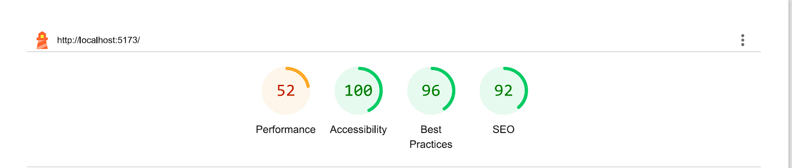
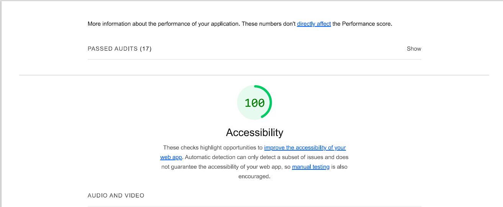
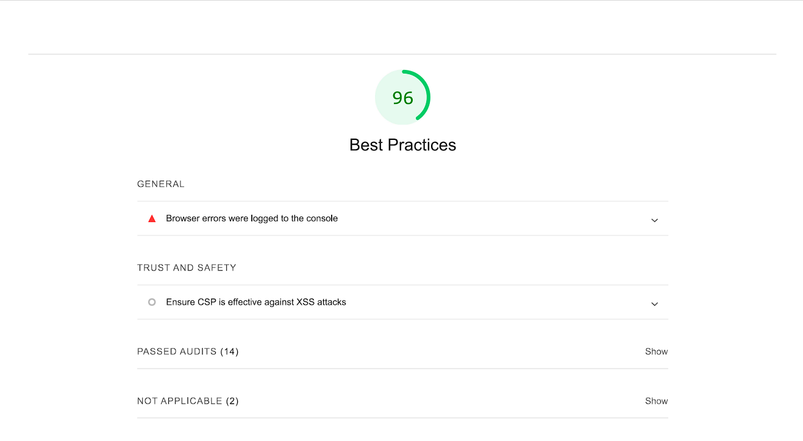

# SPACEX

## Overview

This project is a web application designed to display SpaceX launches and rockets information in a visually engaging way. It uses real-time data from the SpaceX API and provides users with an interactive experience. This is also reponsive so you can use it any device. The app focuses on accessibility, SEO, and performance, ensuring an optimal user experience across devices, meeting the requirements for modern web standards.

- Link to the website-> https://spacexbysivaram.netlify.app/

## TABLE OF CONTENTS

- Framework
- Architecture
- Challenges
- LightHouse Report
- Areas of improvement

# Framework

- React: Used for building the user interface with a component-based architecture, ensuring scalability and maintainability.
- Tailwind CSS: Chosen for its utility-first approach, enabling rapid development of responsive designs.
- TypeScript: Implemented to enforce type safety and improve the overall development experience.

# Architecture

The application follows a modular, component-based architecture, leveraging React for state management and rendering. It makes extensive use of custom hooks to handle side effects and data fetching.

## Key components
- Custom Hooks: Created custom hooks to fetch data, and also another hook to post data in case of graphql query.
- ImageCarousel: Displays SpaceX launch cards in a carousel format with navigation buttons for switching between slides.
- RocketCardSection: Renders SpaceX rocket data fetched from the API in individual card layouts.
- ScrollAnimation: A custom hook that adds animations to elements as they come into the viewport while scrolling.
- Modal: Used to display specific rocket information in an overlay, ensuring better user interaction.

# Challenges

- I encountered several challenges while building this project. The API does not provide sufficient data as expected; for example, the dates are outdated, and many recent launches lack both images and content. As a result, I had to implement fallback images for those entries without visuals.

- Additionally, some endpoints' GraphQL queries, particularly those involving aggregation functions, are not working as documented. Despite the API documentation claiming to support valid MongoDB queries, it does not support aggregation queries, forcing me to filter the data on the front end.

- Given that this webpage heavily relies on images, creating a responsive design that accommodates them has proven to be quite challenging.

# Light House Report

- Accessibility: 100% – The application meets the highest accessibility standards. Features include semantic HTML elements, sufficient color contrast, and fully labeled interactive components.
- SEO: 92% – Optimized for search engines with appropriate metadata, structured content, and clear titles.
- Best Practices: 79% – While mostly aligned with modern web best practices, minor improvements could be made, including ensuring all external resources are loaded securely.
- Performance: 54% – The app performs decently on modern devices, though image optimizations and code-splitting can improve this further.

# Areas of improvement

## Performance Optimisation:

- From the light house report it is clearly stated that the website takes long time to load because of high use of images and animation. To reduce the loading time compress images and ensure correct sizing for faster load times.
- Lazy-load components and routes to reduce initial bundle size and improve load speed.
- And also choose better API provider, because the current api doesn't provide suffcient data.
